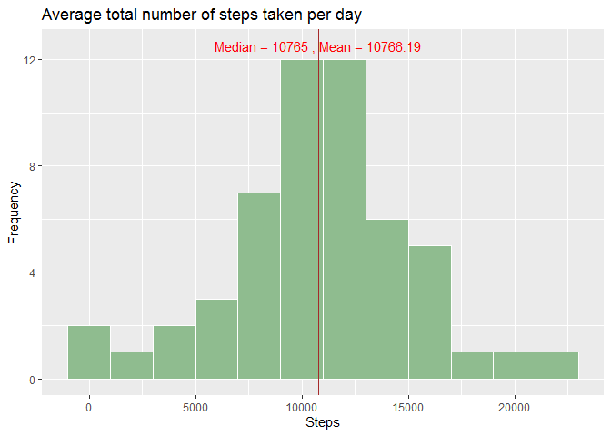
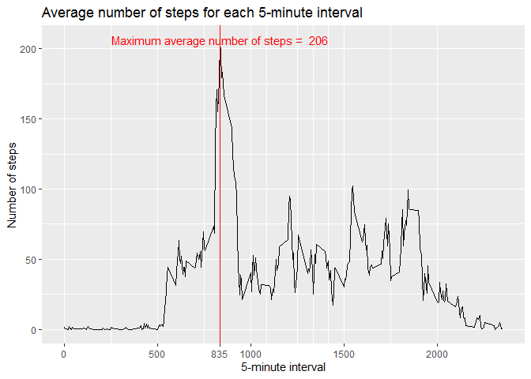
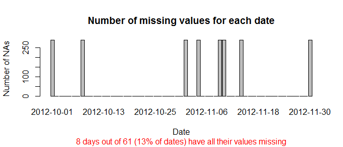
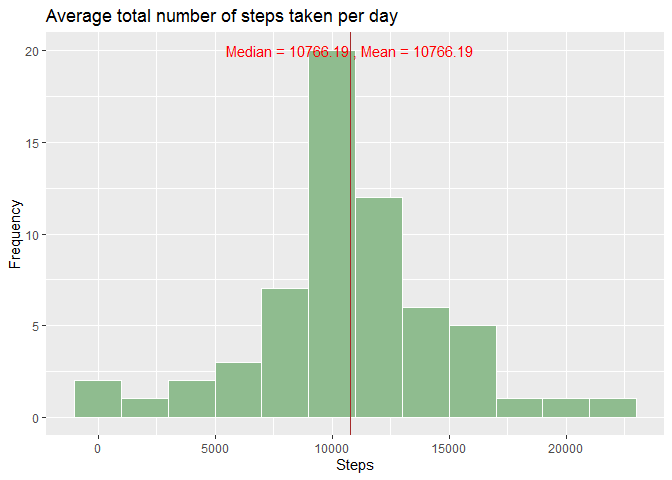
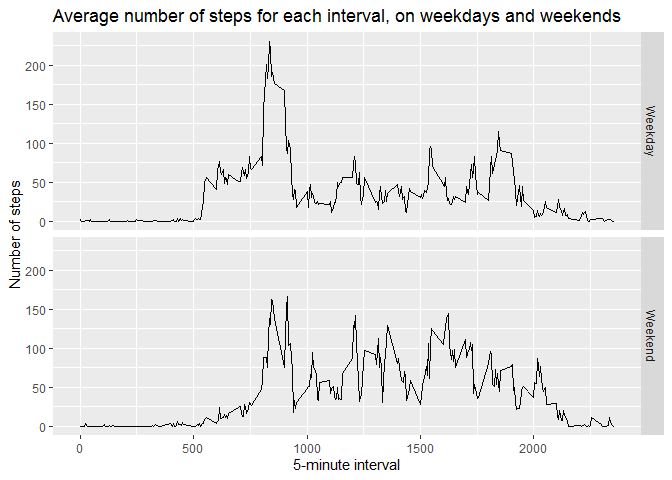

## Loading and preprocessing the data
        
The data for this assignment can be downloaded from the course web site:  

* Dataset: [Activity monitoring data](https://d396qusza40orc.cloudfront.net/repdata%2Fdata%2Factivity.zip) [52K]
* Alternatively, the data are available on this GitHub repository.

After the Dataset was downloaded, we read the data and put in in the data frame
called `Act`:  


```r
unzip("activity.zip")
Act <- read.csv("activity.csv")
```


## What is mean total number of steps taken per day?


```r
library(ggplot2)
Steps <- tapply(X = Act$steps, INDEX = Act$date, FUN = "sum")
mean.Steps <- mean(Steps, na.rm = TRUE)
med.Steps <- median(Steps, na.rm = TRUE)
ds <- data.frame(S = Steps)
g <- ggplot(data = ds, aes(S))
g <- g + geom_histogram(binwidth = 2000, fill="darkseagreen", color="white", na.rm = TRUE) 
g <- g + geom_vline(aes(xintercept=med.Steps), col = "brown", show.legend = TRUE)
g <- g + labs(x = "Steps", y = "Frequency", 
              title = "Average total number of steps taken per day")
g <- g + annotate("text", x = med.Steps, y = 12.5, col = "red", 
                  label = paste("Median =", med.Steps, ", Mean =", round(mean.Steps,2)))
g
```

<!-- -->


## What is the average daily activity pattern?


```r
library(dplyr)
Act2 <- group_by(Act, interval)
ds <- data.frame(summarize(Act2, avg = mean(steps, na.rm = TRUE)))
g <- ggplot(data = ds, aes(interval, avg))
g <- g + geom_line(na.rm = TRUE) 
g <- g + geom_vline(aes(xintercept=ds[ds$avg==max(ds$avg),1]), col = "red")
g <- g + labs(x = "5-minute interval", y = "Number of steps", 
              title = "Average number of steps for each 5-minute interval")
g <- g + annotate("text", x = ds[ds$avg==max(ds$avg),1], y = max(ds$avg), col = "red", 
                  label = paste("Maximum average number of steps = ", round(max(ds$avg))))
g <- g + scale_x_continuous(breaks = c(pretty(ds$interval), ds[ds$avg==max(ds$avg),1]))
g
```

<!-- -->


## Imputing missing values

Total number of missing values: 

```r
nrow(subset(Act, is.na(Act$steps)))
```

```
## [1] 2304
```

This is about 13% of all observations:

```r
100 * round(nrow(subset(Act, is.na(Act$steps))) / nrow(Act),4)
```

```
## [1] 13.11
```

Let us look at the distribution of missing values across the dates.


```r
Act2 <- group_by(Act, date)
StepsNA <- summarize(Act2, cnt = sum(1*is.na(steps)))
barplot(StepsNA$cnt~StepsNA$date, 
        main = "Number of missing values for each date", 
        xlab = "Date", ylab = "Number of NAs")
title(sub = "8 days out of 61 (13% of dates) have all their values missing", 
      col.sub = "red")
```

<!-- -->

This barplot shows us that missing values always take place during whole days.
So we cannot use the mean/median for those days to fill missing value.
One possible strategy for imputing missing value is a mean for that 5-minute interval across all days.

Let us create a new dataset with the missing data filled in according to this strategy.


```r
Act2 <- group_by(Act, interval)
Steps2 <- summarize(Act2, avg = mean(steps, na.rm = TRUE))
Act2$steps <- ifelse(is.na(Act2$steps),Steps2$avg,Act2$steps)
```

Then check the impact on basic summaries


```r
Act2 <- ungroup(Act2)
Steps <- tapply(X = Act2$steps, INDEX = Act2$date, FUN = "sum")
mean.Steps <- mean(Steps)
med.Steps <- median(Steps)
ds <- data.frame(S = Steps)
g <- ggplot(data = ds, aes(S))
g <- g + geom_histogram(binwidth = 2000, fill="darkseagreen", color="white") 
g <- g + geom_vline(aes(xintercept=med.Steps), col = "brown", show.legend = TRUE)
g <- g + labs(x = "Steps", y = "Frequency", 
              title = "Average total number of steps taken per day")
g <- g + annotate("text", x = med.Steps, y = 20, col = "red", 
                  label = paste("Median =", round(med.Steps,2), ", Mean =", round(mean.Steps,2)))
g
```

<!-- -->

Frequencies increased but mean and median remained practically the same (median became exactly equal to the mean).

## Are there differences in activity patterns between weekdays and weekends?

First, create factor variable to separate weekdays and weekends


```r
library(lubridate)
Sys.setlocale(category = "LC_TIME", locale = "C")
```

```
## [1] "C"
```

```r
Act2$Weekday <- weekdays(ymd(Act2$date))
Act2$WeekFactor <- ifelse(Act2$Weekday == "Saturday" | Act2$Weekday == "Sunday", 
                          "Weekend", "Weekday")
Act2$WeekFactor <- as.factor(Act2$WeekFactor)
Act2$Weekday <- NULL
```

Then plot the daily activity patterns for weekdays/weekends


```r
Act2 <- group_by(Act2, WeekFactor, interval)
ds <- data.frame(summarize(Act2, avg = mean(steps)))
g <- ggplot(data = ds, aes(x = interval, y = avg, z = WeekFactor))
g <- g + geom_line() + facet_grid(rows = vars(WeekFactor))
g <- g + labs(x = "5-minute interval", y = "Number of steps", 
              title = "Average number of steps for each interval, on weekdays and weekends")
g
```

<!-- -->

Check summaries for weekends and weekdays


```r
Steps2 <- summarize(Act2, avg = mean(steps))
Stats2 <- summarize(Steps2, Max = max(avg))
Mean2 <- summarize(Steps2, Avg = mean(avg))
Stats2$Avg <- Mean2$Avg
print(Stats2)
```

```
## # A tibble: 2 x 3
##   WeekFactor   Max   Avg
##   <fct>      <dbl> <dbl>
## 1 Weekday     230.  35.6
## 2 Weekend     167.  42.4
```

Following are differences in activity patterns between weekdays and weekends:

* Earlier start and end of activities on weekdays
* Lesser maximum but higher average number of steps on weekends
    + which probably means more uniform weekend activities comparing to weekdays
    
## Possible improvement of analysis

We used the NAs imputing strategy based on mean for 5-minute interval across *all days*. But, there is a difference in patterns between weekdays and weekends. To see the patterns better, we might take another approach, counting 5-interval mean only for relevant weekdays/weekends category.
